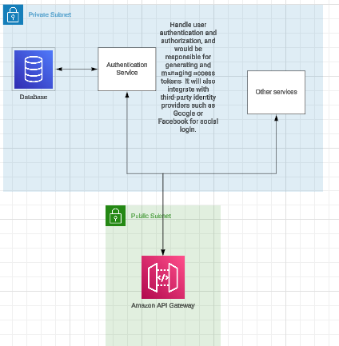

# Authentication Service

This project is a Spring Boot application that implements JWT (JSON Web Token) authentication for securing RESTful APIs.
It is designed to be used as a microservice within an internal network for handling authentication, meaning HTTPS is not required in this context. Ensure the network is secure and trusted.


## Features

- **User Registration**: Allows new users to create an account.
- **User Login**: Authenticates users and provides a JWT for authorized access.
- **Secure Endpoints**: Protects API endpoints, granting access only to authenticated users.
- **Stateless Authentication**: Employs JWTs to maintain a stateless session, eliminating the need for server-side session storage.

## Prerequisites

**Note**: Alternatively, use **Docker Compose** to simplify the setup process.

- **Java 21**: Ensure Java Development Kit (JDK) 21 is installed.
- **Maven 3.8+**: Required for building and managing project dependencies.
- **MySQL**: A running MySQL instance for the application's database.


## Getting Started

1. **With docker**:
   ```bash
   git clone https://github.com/Ezefalcon/authentication.git
   ```
    ```bash
   cd authentication
   ```
   ```bash
   docker-compose up -d
   ```

2. **Local env:**

## Step 1: Clone the Repository
    git clone https://github.com/Ezefalcon/authentication.git

## Step 2: Navigate to the Project Directory
    cd authentication

## Step 3: Build the Project
    mvn clean install

## Step 4: Start the Application
    mvn spring-boot:run

### API Endpoints

#### User Registration

Registers a new user.

 ```bash
    curl --location 'http://localhost:8080/api/users' \
    --header 'Content-Type: application/json' \
    --data '{
        "username": "test",
        "password": "password"
    }'
```

#### User Login

Authenticates a user and returns a JWT.

```bash 
    curl --location 'http://localhost:8080/api/users/login' \
    --header 'Content-Type: application/json' \
    --data '{
        "username": "admin",
        "password": "adminPass"
    }'
```

# Security Configuration
## Overview of Security Features

The application uses Spring Security to manage authentication and authorization. Key configurations include:

### CSRF Protection
Disabled to allow stateless authentication.

### Session Management
Configured to be stateless using JWTs.

### Endpoint Security
*   **Public Endpoints**: `/auth` and `/auth/login` are public.
*   All other endpoints require authentication.
